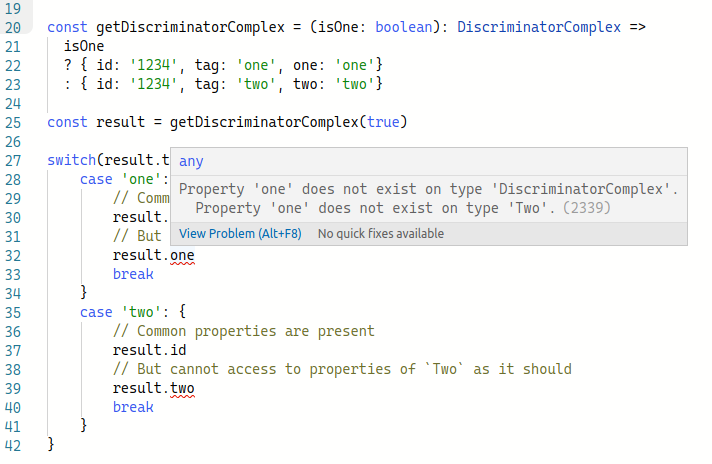

# openapi-typescript-codegen-discriminator-report

Example to reproduce issue with discriminators on
[ferdikoomen/openapi-typescript-codegen #985](https://github.com/ferdikoomen/openapi-typescript-codegen/issues/985)

### Working example

Given a `oneOf` schema consisting of two refs, each of one has a `type` property
used as discriminator:

```yaml
components:
  schemas:
    AorB:
      type: string
      enum:
        - a
        - b
    A:
      type: object
      required:
        - a
        - tag
      properties:
        a:
          type: string
        tag:
          '$ref': '#/components/schemas/AorB'
    B:
      type: object
      required:
        - b
        - tag
      properties:
        b:
          type: string
        tag:
          '$ref': '#/components/schemas/AorB'
    DiscriminatorSimple:
      discriminator:
        propertyName: tag
        mapping:
          a: '#/components/schemas/A'
          b: '#/components/schemas/B'
      oneOf:
        - '$ref': '#/components/schemas/A'
        - '$ref': '#/components/schemas/B'
```

The following types are generated:

```ts
// DiscriminatorSimple.ts
import type { A } from './A';
import type { B } from './B';

export type DiscriminatorSimple = (A | B);

// A.ts
export type A = {
    'a': string;
    tag: 'a';
};

// B.ts
export type B = {
    'b': string;
    tag: 'b';
};
```

The discriminators are handled correctly in this case, each of the memebrs of
`DiscriminatorSimple` have the literal type used in their discriminator property
(`tag`).

### Failing example

Another example with `oneOf` consisting of two refs, however those refs are not
simple objects but composed with `allOf` by extending from a base ref and adding
some props of their own. The discriminator property in this case is part of the
base ref, however the same result happens if the discriminator is present in
each of the refs instead of the base one.

```yml
components:
  schemas:
    DiscriminatorType:
      type: string
      enum:
        - one
        - two
    Base:
      type: object
      required:
        - id
        - tag
      properties:
        id:
          type: string
        tag:
          '$ref': '#/components/schemas/DiscriminatorType'
    One:
      allOf:
        - '$ref': '#/components/schemas/Base'
        - type: object
          required:
            - one
          properties:
            one:
              type: string
    Two:
      allOf:
        - '$ref': '#/components/schemas/Base'
        - type: object
          required:
            - two
          properties:
            two:
              type: string
    DiscriminatorComplex:
      discriminator:
        propertyName: tag
        mapping:
          one: '#/components/schemas/One'
          two: '#/components/schemas/Two'
      oneOf:
        - '$ref': '#/components/schemas/One'
        - '$ref': '#/components/schemas/Two'
```

That results in the following generated code:


```ts
// DiscriminatorType.ts
export type DiscriminatorType = 'a' | 'b';

// Base.ts
import type { DiscriminatorType } from './DiscriminatorType';

export type Base = {
    id: string;
    tag: DiscriminatorType;
};

// DiscriminatorComplex.ts
import type { One } from './One';
import type { Two } from './Two';

export type DiscriminatorComplex = (One | Two);

// One.ts
import type { Base } from './Base';

export type One = (Base & {
    one: string;
});

// Two.ts
import type { Base } from './Base';

export type Two = (Base & {
    two: string;
});
```

Since the discriminator property (`tag`) is in base, instead of each element of
the `DiscriminatorComplex` type having it's own property with the literal type,
like the working example, it is not possible to discriminate.



[See example in TypeScript Playground](https://tsplay.dev/WP7qzm)

